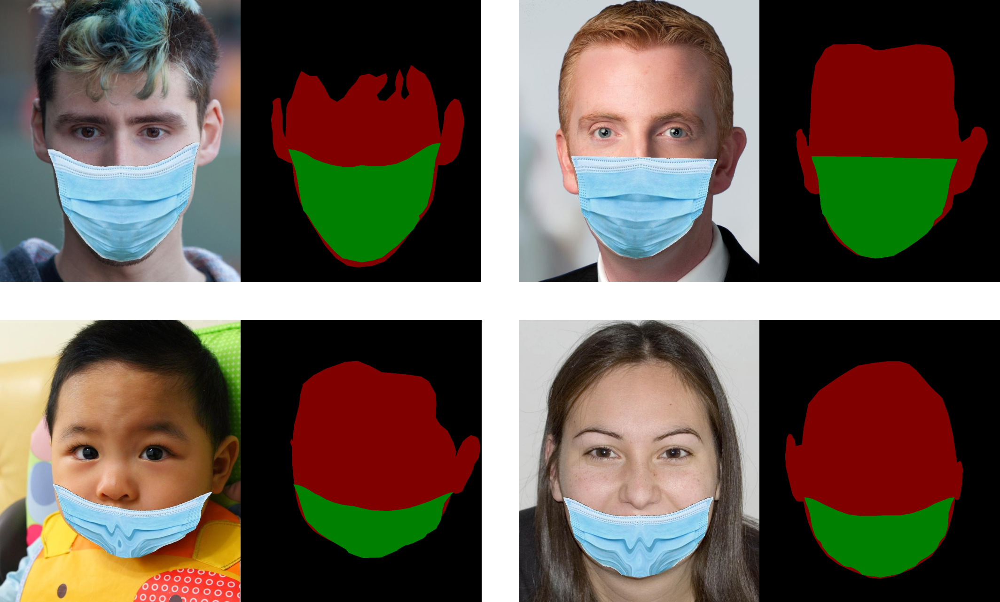

# MaskedFaceSegmentation-Dataset

## Welcome to MaskedFaceSegmentation-Dataset repository

This is dataset for multiclass facemask semantic segmentation and classification. Dataset contains face images that use masks **correctly** and **incorrectly**. The image is obtained from MaskedFace-Net dataset [1].

There are 500 images which are divided into 2 (two) classes:

* 300 images with Correct Wear Mask (CWM) at 1024x1024
* 200 images with Incorrect Wear Mask (IWM) at 1024x1024

The dataset is also divided into training data and testing data :

* 450 images for training data
* 50 images for testing data

Below is a summary of data distribution from the dataset :

|   Class Name   | Data Training | Data Testing |   **Total**    |
|:--------------:|:-------------:|:------------:|:--------------:|
|       CWM      |      275      |      25      | **300**        |
|       IWM      |      175      |      25      | **200**        |
|   **Total**    |    **450**    |    **50**    | **500**        |

## Example Images and Ground Truth

## References
1. Cabani, Adnane, et al. "MaskedFace-Net–A dataset of correctly/incorrectly masked face images in the context of COVID-19." Smart Health 19 (2021): 100144. -- [Link](https://www.sciencedirect.com/science/article/pii/S2352648320300362?via%3Dihub)
